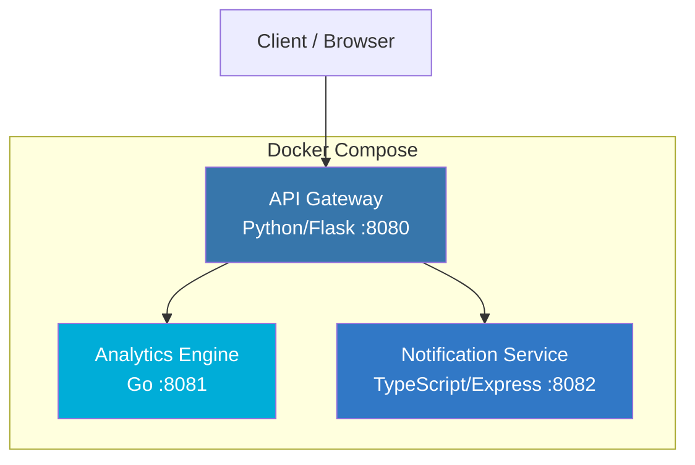

# PulsaFlow

A microservice-based workflow automation platform that enables creating, tracking, and monitoring automated workflows with real-time analytics and notifications.

## Architecture



## Services

| Service | Language | Port | Description |
|---------|----------|------|-------------|
| API Gateway | Python (Flask) | 8080 | Central entry point, routes requests, orchestrates services |
| Analytics Engine | Go | 8081 | Records and analyzes workflow events, provides statistics |
| Notification Service | TypeScript (Express) | 8082 | Sends notifications across channels when workflow events occur |

## Quick Start

### Prerequisites

- Docker and Docker Compose
- (For local development) Python 3.12+, Go 1.22+, Node.js 20+

### Using Docker Compose

```bash
# Copy environment config
cp .env.example .env

# Start all services
make up

# Check health
make health

# View logs
make logs

# Stop all services
make down
```

### Local Development

```bash
# Run all tests
make test

# Run linting
make lint
```

## API Reference

### API Gateway (port 8080)

| Method | Endpoint | Description |
|--------|----------|-------------|
| GET | `/health` | Health check |
| POST | `/api/workflows` | Create a new workflow |
| GET | `/api/workflows` | List all workflows |
| GET | `/api/workflows/:id` | Get workflow by ID |
| GET | `/api/status` | Check all service statuses |

#### Create Workflow

```bash
curl -X POST http://localhost:8080/api/workflows \
  -H "Content-Type: application/json" \
  -d '{"name": "My Workflow", "description": "Example workflow", "notify_channel": "email"}'
```

### Analytics Engine (port 8081)

| Method | Endpoint | Description |
|--------|----------|-------------|
| GET | `/health` | Health check |
| POST | `/analytics/event` | Record an analytics event |
| GET | `/analytics/events` | List all events |
| GET | `/analytics/stats` | Get event statistics |

### Notification Service (port 8082)

| Method | Endpoint | Description |
|--------|----------|-------------|
| GET | `/health` | Health check |
| POST | `/notifications/send` | Send a notification |
| GET | `/notifications` | List all notifications |
| GET | `/notifications/channels` | List notification channels |

## Environment Variables

See [`.env.example`](.env.example) for all configurable options:

| Variable | Default | Description |
|----------|---------|-------------|
| `API_GATEWAY_PORT` | 8080 | API Gateway exposed port |
| `ANALYTICS_PORT` | 8081 | Analytics Engine exposed port |
| `NOTIFICATION_PORT` | 8082 | Notification Service exposed port |
| `LOG_LEVEL` | info | Log verbosity (debug, info, warn, error) |
| `FLASK_DEBUG` | false | Enable Flask debug mode |

## Testing

```bash
# All tests
make test

# Individual services
make test-python
make test-go
make test-ts

# Linting
make lint
```

## CI/CD

GitHub Actions workflow runs on every push/PR to `main`:
1. Python tests + flake8 lint
2. Go tests + vet
3. TypeScript tests + ESLint
4. Docker Compose build verification

> **Note:** The `.github/workflows/ci.yml` file may need to be manually added after initial repository setup due to GitHub API limitations.

## Project Structure

```
pulsaflow/
├── api-gateway/           # Python Flask API Gateway
│   ├── app.py
│   ├── test_app.py
│   ├── requirements.txt
│   └── Dockerfile
├── analytics-engine/      # Go Analytics Engine
│   ├── main.go
│   ├── main_test.go
│   ├── go.mod
│   └── Dockerfile
├── notification-service/  # TypeScript Notification Service
│   ├── src/
│   │   ├── index.ts
│   │   └── index.test.ts
│   ├── package.json
│   ├── tsconfig.json
│   └── Dockerfile
├── docker-compose.yml
├── Makefile
├── .env.example
├── .gitignore
└── README.md
```

## License

MIT
